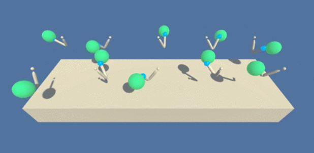

# Environment:

## Goal
The goal of your agent is to maintain its position at the target location for as many time steps as possible. It means that the double-jointed arm needs to touch the ball (target) as many many times as possible

## Game Over
The game ends after 1001 steps

## Rewards:
- double-jointed arm touches the ball: +0.1

## State Action:
The observation space consists of 33 variables corresponding to position, rotation, velocity, and angular velocities of the arm. 

Each action is a vector with four numbers, corresponding to torque applicable to two joints. Every entry in the action vector should be a number between -1 and 1.

- State: There are 33 features on each State
- Action: There are 4 contunous possible actions to take in each State

## Solve the Task
In order to solve the environment, your agent must get an average score of +30 over 100 consecutive episodes

# The Model:
We will create a DDPG Model with:
- Replay Buffer
- Fixed Target 
- OUActionNoise

